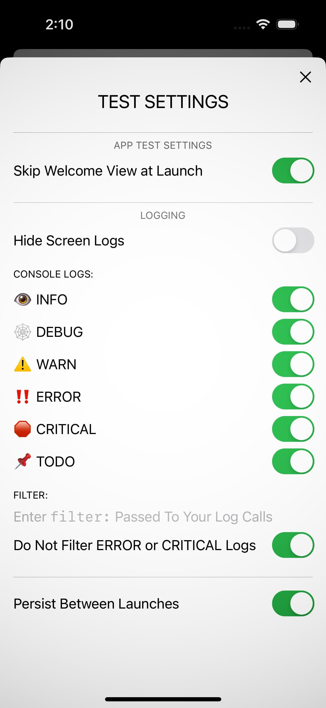

# **`DurableTestHarness`** Swift Package

## Overview
A framework for aiding the **development and testing of SwiftUI apps**.

## Demo

There is a complete Xcode demo project available [**here**](https://github.com/durablebrandsoftware/DurableTestHarnessDemo) in a separate repo that you can compile and run to see how to use this package in iOS and macOS apps:

https://github.com/durablebrandsoftware/DurableTestHarnessDemo

 See the `DemoApp.swift` file in that project for details.

Further details and a more complete descriptions can be found here:
https://www.durablebrand.software/random-access/swiftui-test-harness

## Installation
This code is provided as **Swift Package** that you can add to your Xcode project's "Package Dependencies" using the following URL:

<code>https://github.com/durablebrandsoftware/DurableTestHarness</code>

Add the following import to your Swift source files to access its features:

`import DurableTestHarness`

  

